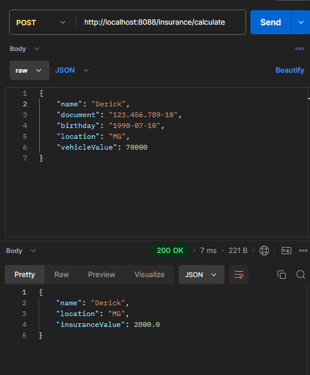
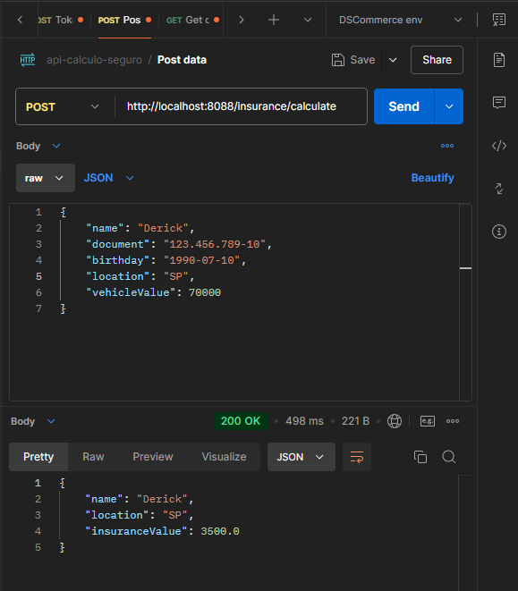
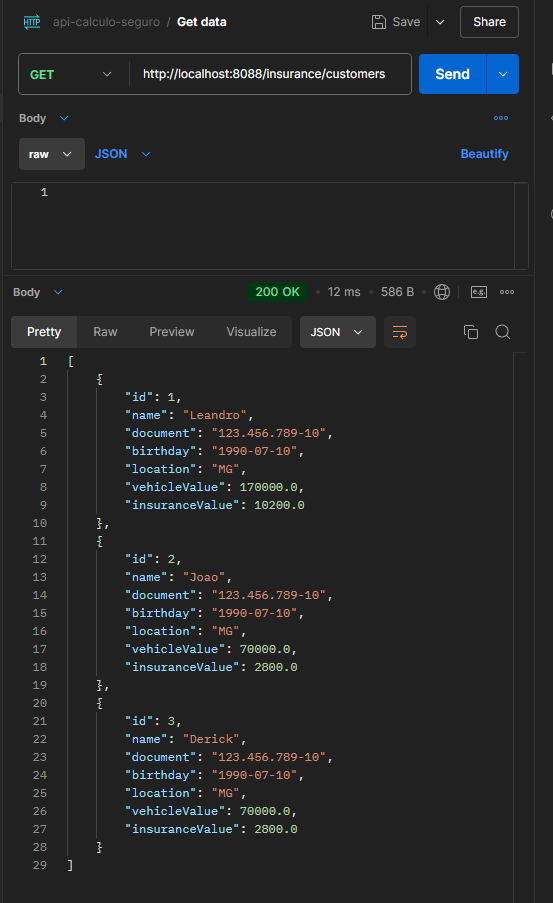
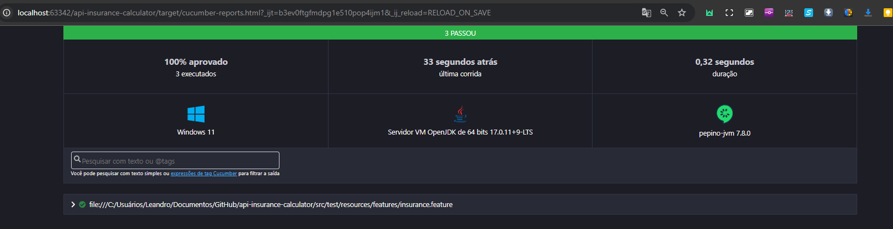

# Insurance Calculator

## STACKS


## Índice
- [Índice](#índice)    - 
    - [1. Introdução](#1-introdução)
        - [Utilização da aplicação:](#utilização-da-aplicação)
            - [input](#input)
    - [2. Estrutura do Projeto](#2-estrutura-do-projeto)
    - [3. Configuração do Banco de Dados H2](#3-configuração-do-banco-de-dados-h2)
    - [4. Executando a Aplicação](#7-executando-a-aplicação)
    - [5. Explicação Teórica](#explicação-teórica)
    - [6.Utilização da Classe BeanConfig](#utilização-da-classe-beanconfig)
    - [7. Imagens de testes](#7-imagens-de-testes)

## <a name="introducao">1. Introdução</a>
A proposta da aplicação é disponibilizar a uma pessoa as modalidades de seguro que melhor se encaixam com seu perfil de acordo com algumas variáveis. Abaixo seguem as regras de negócio relacionadas ao seguro de acordo com o valor do veículo:

| Valor do Veículo                | % do cálculo |
|---------------------------------|--------------|
| Veículo <= 70.000               | 4%           |
| Veículo <= 70.000 e cidade SP   | 5%           |
| Veículo > 70.000 e < 100.000    | 5.5%         |
| Veículo => 100.000              | 6%           |

### Utilização da aplicação:
A aplicação deve receber como entrada essas informações:

##### input
```json
{
  "customer": {
    "name": "João",
    "document": "123.456.789-10",
    "birthday": "1990-07-10",
    "location": "BH",
    "vehicle_value": 70000
  }
}
```
E deve responder essas informações:

### output
```json
{
  "customer": {
    "name": "João",
    "location": "BH",
    "value": 2800
  }
}
```

## <a name="estrutura-do-projeto">2. Estrutura do Projeto</a>


```
insurance-calculator/
├── src/
│   ├── main/
│   │   ├── java/
│   │   │   └── com/
│   │   │       └── example/
│   │   │           └── insurance/
│   │   │               ├── InsuranceCalculatorApplication.java
│   │   │               ├── adapter/
│   │   │               │   ├── controller/
│   │   │               │   │   └── InsuranceController.java
│   │   │               │   ├── dto/
│   │   │               │   │   └── CustomerDTO.java
│   │   │               │   ├── mapper/
│   │   │               │   │   └── CustomerMapper.java
│   │   │               │   └── repository/
│   │   │               │       └── CustomerRepository.java
│   │   │               ├── config/
│   │   │               │   ├── BeanConfig.java
│   │   │               │   ├── LoggingInterceptor.java
│   │   │               │   └── WebConfig.java
│   │   │               ├── core/
│   │   │               │   ├── domain/
│   │   │               │   │   └── Customer.java
│   │   │               │   ├── port/
│   │   │               │   │   └── CustomerServicePort.java
│   │   │               │   ├── service/
│   │   │               │   │   ├── CustomerServiceImpl.java
│   │   │               │   │   └── strategy/
│   │   │               │   │       ├── CalculationStrategy.java
│   │   │               │   │       ├── CalculationStrategyFactory.java
│   │   │               │   │       ├── LowValueStrategy.java
│   │   │               │   │       ├── MediumValueStrategy.java
│   │   │               │   │       └── HighValueStrategy.java
│   │   └── resources/
│   │       ├── application.properties
│   │       └── logback-spring.xml
└── pom.xml

```
## <a name="configuracao-do-banco-de-dados-h2">3. Configuração do Banco de Dados H2</a>

Adicione as seguintes configurações no arquivo application.properties:

```json
spring.datasource.url=jdbc:h2:mem:testdb
spring.datasource.driverClassName=org.h2.Driver
spring.datasource.username=sa
spring.datasource.password=password
spring.jpa.database-platform=org.hibernate.dialect.H2Dialect
spring.h2.console.enabled=true
```

## <a name="executando-a-aplicacao">4. Executando a Aplicação</a>
json
Para executar a aplicação, você pode usar o comando:
mvn spring-boot:run
```
## <a name="executando-os-testes">4. Executando os Testes</a>
```json
Para executar os testes e gerar o relatório, use o comando:
mvn test
```
O relatório será gerado em target/cucumber-report/index.html.


## <a name="executando-a-aplicacao">5. Implementação Explicação Teórica</a>
Escolha do Padrão Strategy
O padrão de projeto Strategy foi escolhido para evitar o uso de condicionais (if-else) na lógica de cálculo do seguro. Esse padrão permite definir uma família de algoritmos, encapsulá-los e torná-los intercambiáveis. No contexto do nosso projeto, cada estratégia de cálculo (baixo valor, médio valor, alto valor) é implementada como uma classe separada que implementa a interface CalculationStrategy. A fábrica de estratégias (CalculationStrategyFactory) é responsável por selecionar a estratégia apropriada com base no valor do veículo do cliente. Isso torna o código mais modular, fácil de entender e de estender, caso novas regras de cálculo sejam adicionadas no futuro.

## <a name="executando-a-aplicacao">6. Utilização da Classe BeanConfig </a>
A classe BeanConfig é utilizada para configurar e gerenciar os beans do Spring. Nela, definimos um bean para a interface CustomerServicePort, que é implementada pela classe CustomerServiceImpl. A fábrica de estratégias (CalculationStrategyFactory) é injetada no serviço através do construtor. Essa abordagem facilita a injeção de dependências e promove a inversão de controle (IoC), um dos princípios fundamentais do Spring Framework. Além disso, a configuração de beans em uma classe separada melhora a organização do código e facilita a manutenção.

```json
package com.example.insurance.config;

import com.example.insurance.core.port.CustomerServicePort;
import com.example.insurance.core.service.CustomerServiceImpl;
import com.example.insurance.core.service.strategy.CalculationStrategyFactory;
import org.springframework.context.annotation.Bean;
import org.springframework.context.annotation.Configuration;

@Configuration
public class BeanConfig {
    @Bean
    public CustomerServicePort customerService(CalculationStrategyFactory strategyFactory) {
        return new CustomerServiceImpl(strategyFactory);
    }
}

```
## <a name="executando-a-aplicacao">7. Imagens de testes </a>
### POST


##  SP

### GET


### TESTE CUCUMBER


Com essas explicações, esperamos que fique claro o motivo das escolhas arquiteturais e de design no projeto.


